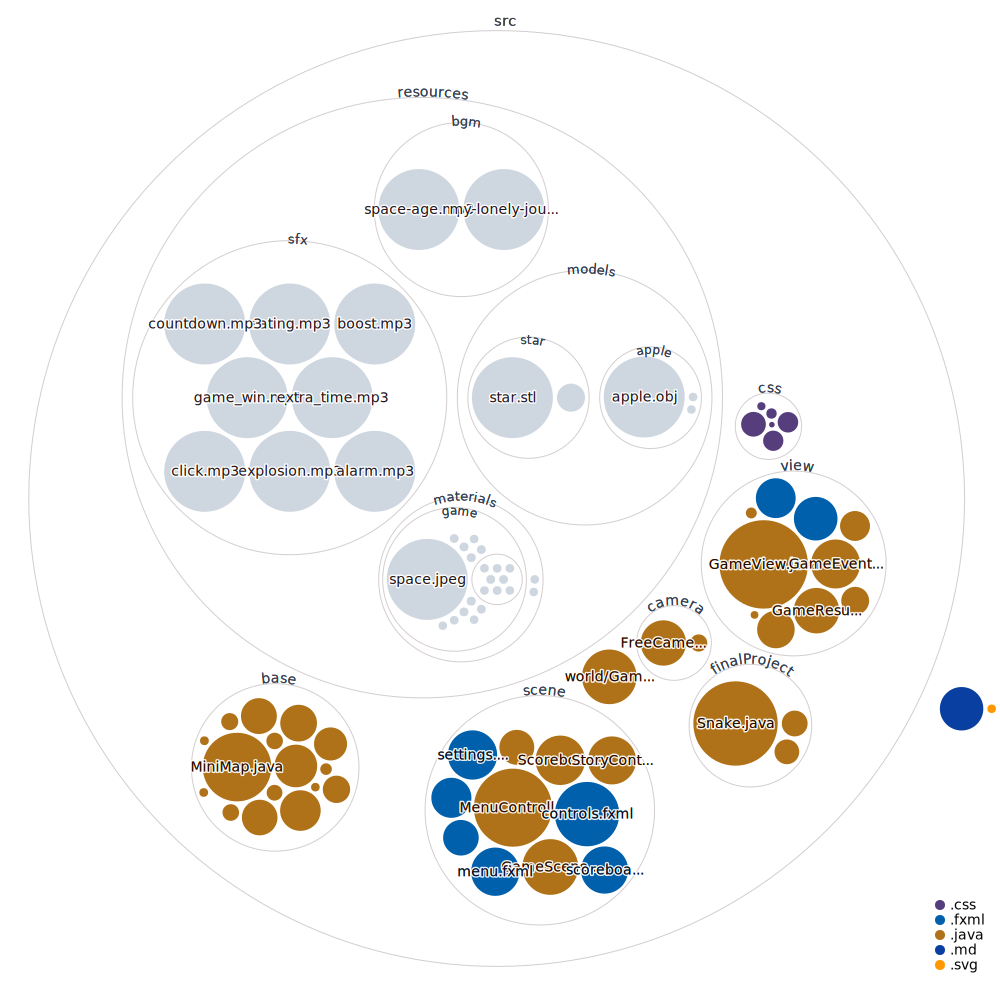

# Final project

## Run Configurations

- main class

    ```
    finalProject.Main
    ```

- VM arguments

    ```
    --module-path "<javafx lib path>" --add-modules javafx.controls,javafx.fxml,javafx.media
    ```

## Library Config

1. jafafx

2. JFX3DModelImporters
    請將 lib 底下的 `JFX3DModelImporters` 複製到電腦，並將其打包成 User Library 之後加進 Class path。
    > 在 `window/preference/user library`

## 操控

```
WASD：操控蛇
```

## FINISHED

- [x] 世界生成
- [x] 將世界鑲入空間分割資料結構中
- [x] 處理蛇與世界互動
- [x] 處理/顯示計分
- [x] 設計遊戲初始/設定介面
- [x] 測試不同 views 之間的切換/分層
- [x] 超出邊界警告音、死亡判定
- [x] 承上，警告 banner
- [x] 不同的死亡標語
- [x] 程式檔案功能註解
- [x] lucky cube 的外觀需要改進
- [x] 不同難度的世界生成
- [x] 基本物件的 mesh
- [x] 解決遊戲物件記憶體不釋放造成嚴重卡頓問題
- [x] 首頁標題、小蛇動畫
- [x] 小蟲不同材質
- [x] 新增遊戲 icon
- [x] 移除對於 javafx3d 來說沒甚麼用的點光源 (還是很氣)
- [x] 新增遊戲好結局畫面
- [x] 新增/優化星球 diffuseMap
- [x] 統一動畫渲染 fps
- [x] 裝上小地圖，顯示蘋果位置
- [x] 又重新修好記憶體釋放bug
- [x] 為超出邊界增加太高、太低訊息
- [x] 修改計分方式
- [x] 新增蘋果剩餘數量

### 共同的 TODO

- [ ] PPT 撰寫

### bocheng 的 TODO

- [ ] menu 的 Game Rule 要更新
- [ ] 在原點加一顆大的星球，但不列入障礙物中

### phantom 的 TODO

- [ ] 裝上小蟲的 mesh (?)
- [x] 需要時整理專案架構

## 設計想法

- 增加難度的方式：提高速度、星球大小/密度、所需吃到的蘋果數量
- buff道具：吃到後可無視障礙物、一段時間內分數 double
- debuff道具（一坨粉塵）：吃到後會加速
- random 道具：隨機獲得效果，外觀採用minecraft中的lucky cube

## 已知問題

- 如果在 run 的時候有出現奇怪的 classNotFound Error，請把 javafx 從 buildpath 移除，再裝回來。

## 世界空間準確設定

世界為圓柱體，圓心位於 (0, 0, 0)。

世界範圍：

- (r, theta, z) 為圓柱坐標系座標

0 <= r <= 1300
0 <= theta <= 2pi
-1300 <= z <= 1300

距離計算方式採混和範數（二維範混極大範）:
dist = Max{ r, |z| }

物品可生成範圍：0 <= dist <= 600
警告開始範圍：800 < dist <= 1300
死亡範圍：1300 < dist

## Visualization


